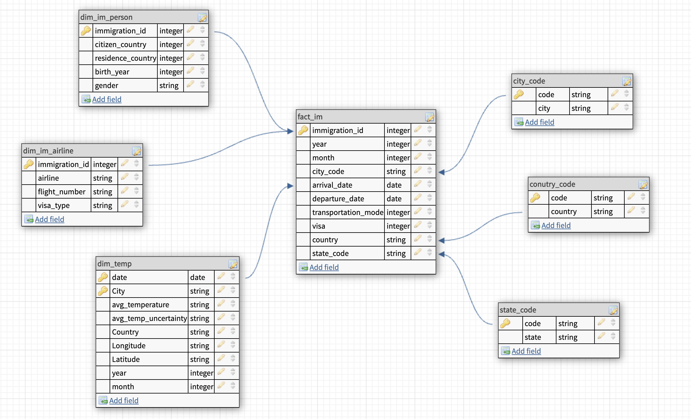

# Capstone Project - Data Engineering Nanodegree Udacity

## Project Scope

The project aims to build an ETL pipeline to integrate and analyze various datasets related to immigration, temperature, demographics, and airport codes. The purpose is to derive insights that could help in understanding migration patterns into the U.S. This project applies data engineering techniques to create a unified data model that serves analytical and reporting needs.

## Steps Taken

1. Data Exploration:
Analyzed the structure and content of the provided datasets.
Inspected the I94 Immigration Data, World Temperature Data, U.S. City Demographic Data, and Airport Code Table.
2. Data Cleaning:
- transforming date values in the correct format.
- convert state and city to upper case in the demography and temp data set 
- standardized the format and structure of datasets
3. Data Transformation:
Aggregated and transformed data to create unified tables. The result is a star schema with a fact and various dimension tables.
4. ETL Pipeline Development:
Designed an ETL pipeline using Python and Apache Spark to process the data sources.
Implemented data extraction, transformation, and loading processes.

## Project Purpose

The primary purpose of this project is to integrate disparate datasets to provide a comprehensive view of immigration trends. By combining immigration records with demographic and temperature data, the project aims to uncover patterns and correlations that could inform policy decisions, business strategies, and academic research.

## Data Model

Defined a star schema to organize the data optimally for analytical queries.
Created dimension tables for immigrants, time, airports, and cities, and fact tables for immigration entries.

The final data model follows a star schema to allow for efficient querying and analysis:

Fact Table: Immigration_Entries

Columns: immigrantid, timeid, portcode, cityid, temperatureid, arrivaldate, departuredate, visatype, etc.

Dimension Tables:

Immigrants: immigrant_id, name, age, gender, nationality, etc.

Time: time_id, day, month, year, weekday, etc.

Airports: portcode, city, state, airportname, etc.

Cities: cityid, cityname, state, population, median_age, etc.

Temperature: temperatureid, date, avgtemperature, city_id, etc.

A data dictionary for the final data model is included, detailing each field and its purpose.

[data_dictionary](data_dictionary.md)

### Quality Assurance
Implemented data quality checks to ensure the integrity and accuracy of the data.
Verified data consistency and correctness.

## Choice of Tools and Technologies

Apache Spark: For efficient handling and processing of large datasets.
Python: For scripting and implementation of the ETL processes.
S3: For data storage and easy access.

## Other Scenarios

### 1. Scenario: data was increased by 100x

To accommodate a 100x increase in data, the following adjustments would be necessary:

- Scalability: Use distributed computing resources such as EMR (Elastic MapReduce) to process data in parallel.
- Storage: Employ scalable storage solutions like Amazon S3 and Redshift managed clusters.
- Optimization: Optimize the ETL pipeline to handle large data volumes by tuning Spark jobs and employing partitioning strategies.

### 2. Scenario: pipelines would be run on a daily basis by 7 am every day

- Scheduling: Use Apache Airflow to schedule and automate the ETL pipeline to run daily at 7 AM.
- Incremental Loads: Implement incremental data loading to process only new or changed data, reducing load times and resource usage.
- Monitoring: Establish monitoring systems to alert if the daily run fails, ensuring timely troubleshooting and resolution.

### 3. Scenario: database needed to be accessed by 100+ people

- Concurrency: Leverage Amazon Redshift's concurrency scaling feature to handle multiple simultaneous queries.
- User Management: Implement robust user access controls and permissions to ensure data security and efficient access management.
- Caching and Indexing: Use caching strategies and create indexes to speed up query responses and improve user experience.

